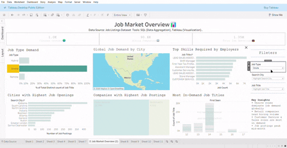
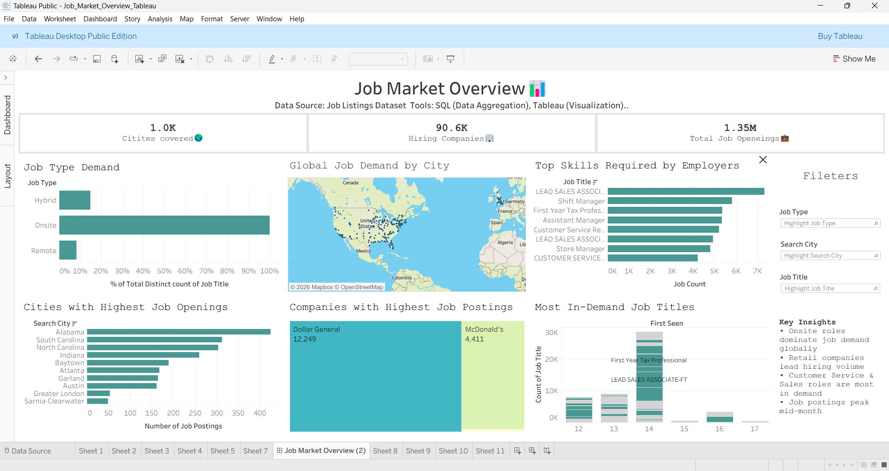

# Job Market Analysis Dashboard (Tableau)

##  Project Description
This project presents an interactive **Job Market Analysis Dashboard** built using **SQL and Tableau**.  
It analyzes large-scale job listings data to uncover global hiring trends across job roles, cities, companies, and required skills.

The dashboard is designed with recruiter-friendly KPIs, interactive filters, and geographic maps to support data-driven decision-making.

---

<h2 align="center"> Project Demo</h2>

  

 **Live Tableau Dashboard**:  
 [Public Link](
 https://public.tableau.com/app/profile/bhargavi.chinnaparapu/viz/JobMarketAnalysisDashboardTableau/JobMarketOverview2?publish=yes)

---

# Key Analysis & Insights

- Analyzed 1.35M+ job postings across 1,000+ cities and 90K+ companies using SQL and Tableau to identify global hiring trends.
- Identified onsite roles accounting for ~70% of total job demand.
- Discovered high-demand job roles, top hiring cities, and leading hiring companies.
- Observed job posting activity patterns and role-wise demand distribution.

---

# Dashboard Screenshot

  

---

# Dashboard Features
- KPI cards showing total job openings, cities covered, and hiring companies
- Interactive filters for **job type, city, and job title**
- Geographic map for city-wise job demand analysis
- Bar charts and treemaps for company and role insights
- Highlight actions and optimized layout for better insight discovery
- KPI formatting using **K / M units** for improved readability

---

# Tools & Technologies
- **SQL** – Data aggregation and transformation  
- **Tableau Public** – Dashboard development and visualization  
- **CSV / Excel** – Source dataset handling  

---

# Project Structure

🔹 Files

- Job_Market_Analysis_Dashboard_Tableau.twbx – Tableau packaged workbook

- dashboard_screenshot.png – Dashboard preview

- dashboard_demo.gif – Dashboard interaction demo
